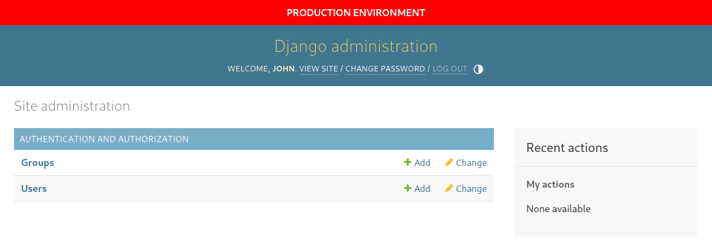

# Django Admin Notice

[![PyPI][pypi-image]][pypi-url]
![PyPI - Python Version][python-image]
![PyPI - Django Version][django-image]
[![License][license-image]][license-url]
[![Tests][tests-image]][tests-url]

[pypi-image]: https://img.shields.io/pypi/v/django-admin-notice
[pypi-url]: https://pypi.org/project/django-admin-notice/
[python-image]: https://img.shields.io/pypi/pyversions/django-admin-notice
[django-image]: https://img.shields.io/pypi/djversions/django-admin-notice
[license-image]: https://img.shields.io/pypi/l/django-admin-notice
[license-url]: https://github.com/DoctorJohn/django-admin-notice/blob/master/LICENSE
[tests-image]: https://github.com/DoctorJohn/django-admin-notice/workflows/Tests/badge.svg
[tests-url]: https://github.com/DoctorJohn/django-admin-notice/actions

Show a floating notice banner above the Django admin interface.
Particularly useful for indicating the current deployment environment.



## Installation

Install django-admin-notice by running `pip install django-admin-notice`

Add `admin_notice` to your `INSTALLED_APPS` somewhere before `django.contrib.admin`.

```python
INSTALLED_APPS = [
    "admin_notice",  # <-- Add this somewhere before "django.contrib.admin"
    "django.contrib.admin",
    # ... other apps
]
```

Add `admin_notice.context_processors.notice` to the templates `context_processors`. 
Having `django.template.context_processors.request` is required as well.

```python
TEMPLATES = [
    {
        "OPTIONS": {
            "context_processors": [
                "django.template.context_processors.request",  # <-- have this
                "admin_notice.context_processors.notice",  # <-- Add this
                # ... other context processors
            ]
        },
    },
]
```

## Settings

Set the `ADMIN_NOTICE_TEXT` to the text you want to show above the admin interface.
No message is shown if this setting is missing or empty.

```python
ADMIN_NOTICE_TEXT = "Production environment"
```

Optionally specify a custom text color and background for your notice.
The default text color is `white` and the default background `red`.

```python
ADMIN_NOTICE_TEXT_COLOR = "white"
ADMIN_NOTICE_BACKGROUND = "red"
```

### Tips

It's a common use case to indicate the projects deployment environment.
The following configuration shows how to obtain the `django-admin-notice`
configuration from environment variables and how to configure a fallback.

```python
from os import environ

ADMIN_NOTICE_TEXT = environ.get("ADMIN_NOTICE_TEXT", "Local environment")
ADMIN_NOTICE_TEXT_COLOR = environ.get("ADMIN_NOTICE_TEXT_COLOR", "white")
ADMIN_NOTICE_BACKGROUND = environ.get("ADMIN_NOTICE_BACKGROUND", "green")
```

## Example project

Take a look at our Django example project under `tests/project`. You can run it by executing these commands:

1. `poetry install`
2. `poetry run python tests/project/manage.py migrate`
3. `poetry run python tests/project/manage.py createsuperuser`
4. `poetry run python tests/project/manage.py runserver`
